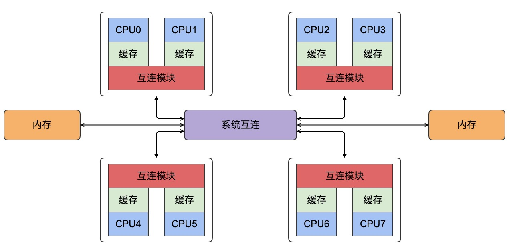

#### CPU硬体系

| 作者 | 时间 |QQ技术交流群 |
| ------ | ------ |------ |
| perrynzhou@gmail.com |2020/12/01 |672152841 |

######  CPU硬件结构

###### CPU执行CAS流程
- CPU0会检查本地告诉缓存，没有找到缓存行
- 请求被转发到CPU0和CPU1的互连模块，检查CPU1的本地高速缓存，没有找到缓存行
- 请求被转发到系统互连模块，检查其他三个芯片，得知缓存行被CPU6和CPU7所在芯片持有
- 请求被转发到CPU6和CPU7的互连模块，检查这两个CPU的 告诉缓存，在CPU7的高速缓存中找到缓存行。
- CPU7将缓存行发送给所属的互连模块，并且刷新自己的高速缓存中的缓存行
- CPU6和CPU7的互连模块将缓存行发送给系统互连模块
- 系统互连模块将缓存行发送给CPU0和CPU1的互连模块
- CPU0和CPU1的互连模块将缓存行发送给CPU0的高速缓存
- CPU0现在可以对高速缓存中变量执行CAS操作
