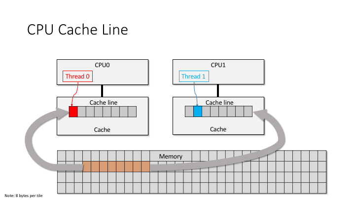

### 并发编程小记


##### CPU架构

- CPU一般会有三级缓存，分别是L1、L2、L3缓存。L1缓存分为数据(L1d)和指令缓存(L1i),一般L1 Cache大小是32K。每层Cache大小按照L1<L2<L3,越小的越靠近CPU，速度也是最快的
- L3以及更高level的Cache是若干个核心共享的Cache


##### 缓存行(Cache Line)

- 在内存和Cache之间的数据传输按照一定大小的块大小进行组织，这些块就是Cache Line.当一个Cache Line从Main Memory拷贝到CPU Cache中Cache Entry会被创建。Cache Entry的结构如下
```
+---------------+---------+-------------------+
|   flag bits   |   tag   |   data block(s)   |
+---------------+---------+-------------------+
```
data block(实际就是Cache Line)包含了从Main Memory获取到的数据，data block大小一般是和机器字长保持一致，一般是32或者64个字节


  

- 一个CPU和其他CPU的core或者Main Memory交互是通过cache entry来同步，这也说明是CPU的内存操作的细粒度是cache line.一般X86 CPU中的Cache Line大小是64个字节，在应用编程中一般为了提供效率，会要求内存对齐。一般可以通过`__attribute__((align(64)))`或者c++11的 `alignas(64)`进行对齐，需要一次load/store就能完成内存的读取和更新

##### CPU Cache更新淘汰策略
- 由于CPU Cache相对Main Memory相对较小，后续有新的内存要进入cache line之前需要进行把之前的cache line替换掉
- 目前CPU支持wt和wb模式，wt模式数据同步写到cpu cache和main memory中；wb模式数据写到cpu cache中，等cpu cache中的数据被淘汰后，数据再次写入main memory

##### 指令重排

- instruction reordering(指令重排)主要由两种，一种是编译器在compile-time产生的指令重排；另外一种是CPU在runtime产生的指令重排，两者都是为了提供运行效率。
	- compile-time:编译器在重排编译生成指令以达到减少使用寄存器load/store的次数，比如编译器发现有个寄存器里面的值可以先写回到内存里，然后over write到该寄存器。compile-time reordering是静态的reordering
	- cpu-runtime:运行时预测在同个instruction stream里那些指令可以先执行，同时减少类似重复load/store的内存或者寄存器。cpu-time是动态的reordering

- cpu-time和complie-time的指令重排都遵循不管指令如何重排，在单个线程里面运行的结果是正确的。
- memory order的问题就是因为指令重排引起的，指令重排导致原来的内存可见顺序发生了变化，在单线程运行时候是没有问题，但是在多核或者多线程里面执行就会出现问题。

#####  complile time reordering
- 源代码
```
int a = 0;
int b= 0;
void mem_order_fn()
{
        a = b+1;
        b=10;
}
```
- 采用编译器O2优化
```
// 对应的mem_order_fn，如下优化后的汇编代码明显不是按照程序执行的顺序执行。
// 汇编代码执行的顺序是: b=10;a=b+1和原来mem_order_fn执行顺序是相反的
_Z12mem_order_fnv:
.LFB0:
        .cfi_startproc
        // 把变量b放到 eax寄存器
        movl    b(%rip), %eax
        // 把立即数10存储变量b中
        movl    $10, b(%rip)
        // 调用addl指令把eax寄存器中的值加1
        addl    $1, %eax
        // 把 eax的当前值存储到变量a
        movl    %eax, a(%rip)
        ret
```
-  添加 compile-time memory order constraint
```
#include <atomic>
int a = 0;
int b= 0;
void mem_order_fn()
{
        a = b+1;
        std::atomic_thread_fence(std::memory_order_release);
        b=10;
}

// 采用std::memory_order_release 访问顺序后，O2优化后的汇编，代码是按照代码逻辑顺序执行的
// store()使用memory_order_release，而load()使用memory_order_acquire。这种模型有两种效果，第一种是可以限制 CPU 指令的重排：

// 在store()之前的所有读写操作，不允许被移动到这个store()的后面。
// 在load()之后的所有读写操作，不允许被移动到这个load()的前面。
_Z12mem_order_fnv:
.LFB342:
        .cfi_startproc
        movl    b(%rip), %eax
        addl    $1, %eax
        movl    %eax, a(%rip)
        movl    $10, b(%rip)
        ret
```

#####  runtime reordering