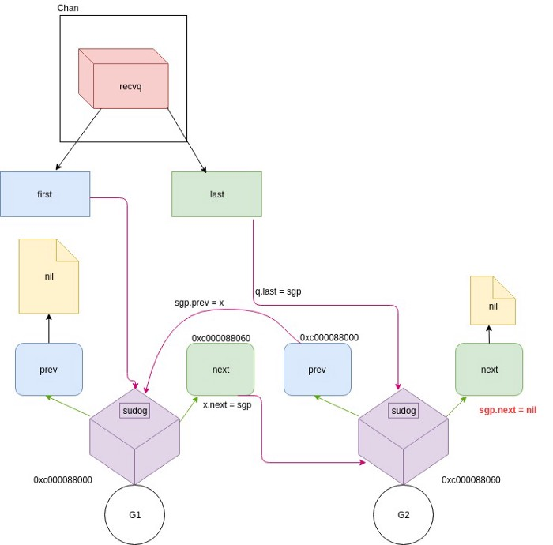

### golang中的channel介绍

| 作者 | 时间 |QQ技术交流群 |
| ------ | ------ |------ |
| perrynzhou@gmail.com |2020/12/01 |672152841 |

### go并发模型介绍
- 并发是需要同步信息，Go语言的并发模型是采用CSP模型(Communicating SequentialProcesses),并发时候的同步是通过channel.Go语言设计并发的核心理念是"通过通信来共享内存而不是通过共享内存来进行通信"
- go语言中的channel负责让goroutine处于可运行状态，前提是在处于阻塞状态的channel发送或者接受数据,gorountine在go语言中是以sudog数据结构表示

### channel 概述
- hchan 和waitq 定义和说明
```
type hchan struct {
	qcount   uint           // total data in the queue
	// 这里是buffer channel中的buffer大小，比如make(chan int,3),这里dataqsiz 就是3
	dataqsiz uint       
	// 实际存储数据的循环队列，仅仅是针对buffer channel有效
	buf      unsafe.Pointer 
	// 在channel中存储单个元素的大小
	elemsize uint16
	// channel的状态，当创建channel时候closed=0，channel是open的状态；当closed=1，则表示channel是处于closed状态
	closed   uint32
	// 存储元素的类型
	elemtype *_type 
	// sendx和recvx表示当前实际发送或者接受的循环队列的索引
	sendx    uint   
	recvx    uint   
	// recvq和sendq是等待队列，当从channel读取或者发送数据时候,存储正在阻塞的goroutine的信息
	recvq    waitq  
	sendq    waitq  

	// 发送或者接受数据的针对channel上的互斥锁
	lock mutex
}

type waitq struct {
	// sudog是golang routine的数据结构
	first *sudog
	last  *sudog
}
```
-  chan和goroutine关系



- 定义简单调试代码
```
func firstGoRoutineA(a chan int) {
	val := <-a
	fmt.Println("firstGoRoutineA recevied the data",val)
}
func secondGoRoutineB(a chan int) {
	val := <-a
	fmt.Println("secondGoRoutineB recevied the data",val)
}

func main() {
	ch :=make(chan int)
	go firstGoRoutineA(ch)
	go secondGoRoutineB(ch)
	ch <-3
	time.Sleep(time.Second*1)
}

// 定义断点
perrynzhou@mint-os:~/Source/go-example/chan$ dlv debug main.go 
(dlv)  break main.main
(dlv)  break main.firstGoRoutineA
(dlv)  break main.secondGoRoutineB
// 当make chan时候会调用
(dlv)  break runtime.makechan
// 当向chan中发送数据时候调用
(dlv)  break runtime.chansend
// 当向chan中读取数据时候调用
(dlv)  break runtime.chanrecv
// gorontine中发送数据时候调用
(dlv)  break runtime.send
// gorontine中接受数据时候调用
(dlv)  break runtime.recv
// 
(dlv)  break runtime.gopark


```
- hchan 内存结构
```

// 当make(chan int)结束后的channel的内存布局
runtime.hchan {
        qcount: 0,
        dataqsiz: 2,
        buf: unsafe.Pointer(0xc000064060),
        elemsize: 8,
        closed: 0,
        elemtype: *runtime._type {size: 8, ptrdata: 0, hash: 4149441018, tflag: tflagUncommon|tflagExtraStar|tflagNamed|tflagRegularMemory (15), align: 8, fieldAlign: 8, kind: 2, equal: runtime.memequal64, gcdata: *0, str: 847, ptrToThis: 26368},
        sendx: 0,
        recvx: 0,
        recvq: runtime.waitq {
                first: *runtime.sudog nil,
                last: *runtime.sudog nil,},
        sendq: runtime.waitq {
                first: *runtime.sudog nil,
                last: *runtime.sudog nil,},
        lock: runtime.mutex {
                lockRankStruct: runtime.lockRankStruct {},
                key: 0,},}
// 当进入goutine时候，此时chan的内存结构如下，在recvq的队列会存储goroutine的结构，这也说明golang中是以通信方式来达到内存共享的方式
*runtime.hchan {
        qcount: 0,
        dataqsiz: 0,
        buf: unsafe.Pointer(0xc000110070),
        elemsize: 8,
        closed: 0,
        elemtype: *runtime._type {size: 8, ptrdata: 0, hash: 4149441018, tflag: tflagUncommon|tflagExtraStar|tflagNamed|tflagRegularMemory (15), align: 8, fieldAlign: 8, kind: 2, equal: runtime.memequal64, gcdata: *0, str: 847, ptrToThis: 26368},
        sendx: 0,
        recvx: 0,
        recvq: runtime.waitq {
                first: *(*runtime.sudog)(0xc00006e000),
                last: *(*runtime.sudog)(0xc00006e000),},
        sendq: runtime.waitq {
                first: *runtime.sudog nil,
                last: *runtime.sudog nil,},
        lock: runtime.mutex {
                lockRankStruct: runtime.lockRankStruct {},
                key: 1,},}
```

### channel的特性
- 当带有缓冲的chan中数据写满了，chan数据会被保存在当前goroutine中
- chan中的数据发送或者接受都是值传递
- 读写nil的channel不会导致但是会导致阻塞
```

func chansend(c *hchan, ep unsafe.Pointer, block bool, callerpc uintptr) bool {
	// 如果chan是为nil,则当前的goroutine会挂起，因此读写nil的channel会导致goroutine阻塞
	if c == nil {
		if !block {
			return false
		}
		gopark(nil, nil, waitReasonChanSendNilChan, traceEvGoStop, 2)
		throw("unreachable")
	}
	//-----忽略------------//
}
```
- 读一个已经closed的channel会导致阻塞
```
func chansend(c *hchan, ep unsafe.Pointer, block bool, callerpc uintptr) bool {
//-----忽略------------//
// chan初始化时候chan.closed是不为1的，当closed这个字段值为1表示channel会被关闭，在写或者发送数据到已经closed的channel时候，会出现panic现象
if c.closed != 0 {
		unlock(&c.lock)
		panic(plainError("send on closed channel"))
	}
}
```
- 写一个closed的channel会导致panic

### 验证
- RunNilChan封装了读写一个nil的例子，从运行角度发现读写过程都是会导致goroutine阻塞
- RunClosedChan封装了读写一个closed的channel的例子，从运行角度发现读已经closed的channel会阻塞;写已经closed的channel会触发panic
- 代码例子
```
package main

import (
	"fmt"
	"log"
	"math/rand"
	"os"
	"os/signal"
	"sync"
	"syscall"
)

func hanleChanFunc(v chan int,wg *sync.WaitGroup,op bool,chType string) {
	id := rand.Int63()%4077
	fmt.Fprintf(os.Stdout,"########## id=%d gorotuine running########\n",id)
	defer fmt.Fprintf(os.Stdout,"########## id=%d gorotuine stop########\n",id)
	wg.Done()
 	if op {
		fmt.Fprintf(os.Stdout," ::read  from %s chan::\n",chType)
		<-v

	}else {
		value := 1
		fmt.Fprintf(os.Stdout," ::write %d to %s chan::\n",value,chType)
		v <- value
	}
}

func RunNilChan(nilChan chan int,wg *sync.WaitGroup) {
	wg.Add(2)
	go hanleChanFunc(nilChan,wg,true,"nil")
	go hanleChanFunc(nilChan,wg,false,"nil")
}
func RunClosedChan(ch chan int,wg *sync.WaitGroup) {
	close(ch)
	wg.Add(1)
	//go hanleChanFunc(ch,wg,true,"closed")
	go hanleChanFunc(ch,wg,false,"closed")
}
func main() {
	sigs := make(chan os.Signal,1)
	signal.Notify(sigs, os.Interrupt, syscall.SIGTERM, syscall.SIGINT)
	wg := &sync.WaitGroup{}
	var nilChan  chan int
	RunNilChan(nilChan,wg)
	// normalCh := make(chan int)
	//	RunClosedChan(normalCh,wg)
    defer 			wg.Wait()
	// go nilChanFunc(nilChan,wg,true,1)
	for {
		select {
		case <-sigs:
			log.Println("recieve stop signal")
			return
		}
	}
}

```